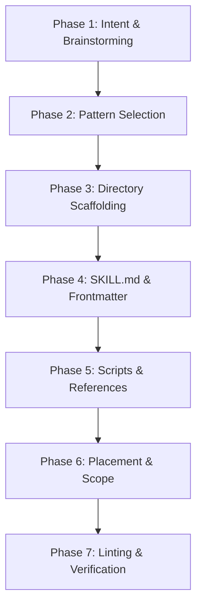

# Antigravity Skill Creator

Guides the interactive creation, scaffolding, and validation of production-ready Agent Skills for Google Antigravity.

Refer to the [Antigravity Skills Specification](./references/antigravity-skills-spec.md) for full architectural background.

---

## The 7-Phase Skill Creation Lifecycle



---

### Phase 1: Intent & Brainstorming

Have a structured conversation to clarify the new skill's requirements before writing any code:

1. **Core Purpose**: What exact task or domain does this skill solve?
2. **Trigger Scenarios**:
   - What will the user typically say to trigger this skill? (English & Korean keywords)
   - When should the agent **NOT** trigger this skill? (Negative boundaries to avoid hijacking other skills)
3. **Inputs & Outputs**:
   - What information or files does the skill consume?
   - What artifacts, files, or responses does it produce?
4. **Failure Modes**:
   - If an API or command fails, should the agent retry with backoff, ask the user, or abort?

---

### Phase 2: Pattern Selection

Choose the right structural pattern based on task requirements (see [Sample Skills](./examples/sample-skills.md)):

| Pattern | Best For | Typical Files |
| :--- | :--- | :--- |
| **A. Instruction-Only** | Pure reasoning, code reviews, checklists, coordinating existing tools. | `SKILL.md`, `references/` |
| **B. Script-Assisted** | Calling external REST/GraphQL APIs, processing bulk data, running custom binaries. | `SKILL.md`, `scripts/`, `references/` |
| **C. Hybrid** | Multi-step agent reasoning accompanied by helper CLI utilities for data transformation. | `SKILL.md`, `scripts/`, `references/`, `examples/` |

---

### Phase 3: Directory Scaffolding

Use the built-in scaffolding tool to generate the standard folder structure:

```bash
# For a workspace-level instruction skill:
python3 .agents/skills/skill-creator/scripts/init_skill.py <skill-name> --scope workspace --type instruction

# For a script-assisted skill:
python3 .agents/skills/skill-creator/scripts/init_skill.py <skill-name> --scope workspace --type script

# For a global skill (available across all projects):
python3 .agents/skills/skill-creator/scripts/init_skill.py <skill-name> --scope global --type hybrid
```

This creates:
```text
<skill-name>/
├── SKILL.md
├── references/guide.md
├── scripts/ (if script/hybrid)
└── examples/
```

---

### Phase 4: Authoring `SKILL.md` & Frontmatter

Edit the generated `SKILL.md`. Adhere strictly to these principles:

1. **Frontmatter Optimization**:
   - Follow the [Description Optimization Guide](./references/description-optimization-guide.md).
   - Ensure `name` is lowercase with hyphens (`[a-z0-9-]+`) and $\le$ 64 characters.
   - Craft a high-density `description` containing positive trigger phrases and negative boundaries.
2. **Progressive Disclosure**:
   - Keep `SKILL.md` concise and focused on high-level workflow and command recipes.
   - Do **NOT** paste large API reference manuals or schemas directly into `SKILL.md`. Put them in `references/` and link to them using relative markdown links (e.g. `[API Schema](./references/schema.md)`).
   - Target line count: **under 500 lines**.

---

### Phase 5: Helper Script Implementation

If the skill requires custom code:
- Follow the [CLI Script Template](./references/cli-script-template.py).
- **Subcommand pattern**: Structure commands with `argparse` (e.g. `search`, `fetch`, `export`).
- **File output principle**: Always provide an `--output` flag and dump large structured JSON/Markdown to files. **Never dump massive JSON payloads to stdout**, as this clutters the LLM's context window.
- **Rate limiting**: Implement monotonic clock throttling and exponential backoff for HTTP 429 and transient 5xx errors.
- **Python standard library preference**: Prefer standard library modules (`urllib`, `json`, `argparse`, `pathlib`) to eliminate dependency install steps.

---

### Phase 6: Scope & Placement

Decide where the skill belongs:

1. **Workspace Scope (`.agents/skills/<skill-name>/`)**:
   - Check into Git repository.
   - Best for project-specific rules, deployment scripts, or repo conventions.
2. **Global Scope (`~/.gemini/antigravity/skills/<skill-name>/`)**:
   - Available across all Antigravity projects and chats on this machine.
   - Best for personal utilities, generic scrapers, or cross-project tools.

---

### Phase 7: Linting & Verification

Run the validation tool to ensure the new skill satisfies all Antigravity constraints:

```bash
python3 .agents/skills/skill-creator/scripts/validate_skill.py <path-to-skill-directory>
```

#### What the validator verifies:
- [x] Frontmatter delimiter and valid YAML keys (`name`, `description`).
- [x] Skill `name` naming convention and length ($\le$ 64 chars).
- [x] `description` presence, length, and trigger phrasing.
- [x] Relative file links resolve to real files.
- [x] `SKILL.md` length complies with progressive disclosure guidelines ($\le$ 500 lines).
- [x] Python scripts in `scripts/` have valid syntax and compilation.

---

## Best Practices Checklist

- [ ] Is the `description` specific enough to prevent over-triggering?
- [ ] Are bulky reference documents moved into `references/`?
- [ ] Do helper scripts write output to files (`--output`) rather than flooding stdout?
- [ ] Are relative links between markdown files valid?
- [ ] Did you run `validate_skill.py` and resolve all errors?
